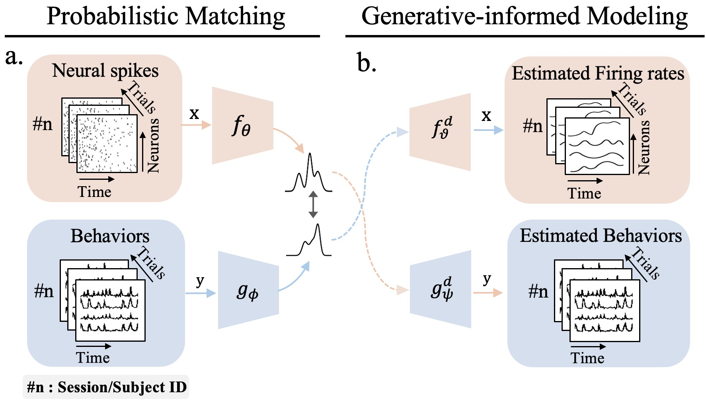

# PNBA: Probabilistic Neural-Behavioral Representation Alignment [ICML2025]

## Overview

PNBA addresses a fundamental question in neuroscience: how can neural circuits generate consistent function across individuals despite structural and physiological heterogeneity?

Our framework employs a probabilistic approach to align neural and behavioral representations across subjects through:

1. **Probabilistic Representational Learning**: Using distribution-level representation modeling to address neural variability across trials, sessions, and subjects.
2. **Cross-modal Representational Alignment**: Establishing reliable alignment between neural activity and behavior.
3. **Generative Constraints**: Preventing representation degeneration during the alignment process.

This approach reveals robust preserved neural representations across different brain regions and species, providing evidence for consistent neural coding principles despite anatomical differences.



## Data

The data used in this project is available from the following repository:
[Sensorium 2023 Data](https://gin.g-node.org/pollytur/sensorium_2023_data/src/798ba8ad041d8f0f0ce879af396d52c7238c2730)

## Usage
We here demonstrate our framework using an accessible example with mouse primary visual cortex (V1) data.

### Training

We suggest the following hardware configurations:

- 8x NVIDIA A100 80GB GPUs
- 512GB RAM 
- 2TB SSD storage for datasets and model checkpoints

To initiate training with the default configuration:
```
python train.py config/config.py
```

### Inference and Evaluations
Before running inference:

1. Update the 'load_from' parameter in config/config.py with your trained model path. Here is the [pretrained weights](https://drive.google.com/file/d/1aV3AXVjm1Gdt1zs7Dt1qaHf8PRxVsCBv/view?usp=drive_link)
2. Run the extraction script with appropriate GPU resources

```
# Extract neural representations (single GPU)
python extract_neural_rep.py config/config.py

# Verify the cross model alignment
python lv_statistics_neural_vs_stimulus.py

# Verify the zero-shot preserved neural presentation
python lv_statistics_activity.py
```

## Acknowledgments

We would like to acknowledge:

- We acknowledge the [**neuralpredictors**](https://github.com/sinzlab/neuralpredictors) repository for providing valuable tools and infrastructure for neural data analysis that significantly contributed to this work.

- We thank the organizers and participants of the **Sensorium2023 Competition** for creating a robust benchmark and collaborative environment that helped advance research in neural representations.

- We acknowledge the foundational work by **Safaie, Mostafa, et al. "Preserved neural dynamics across animals performing similar behaviour." Nature 623.7988 (2023): 765-771**,  which provided key insights into neural representational consistency on motor cortices.

## Citation
If you use this code in your research, please cite our paper:

```
@article{zhu2025neural,
  title={Neural Representational Consistency Emerges from Probabilistic Neural-Behavioral Representation Alignment},
  author={Zhu, Yu, Song, Chunfeng, Ouyang, Wanli, Yu, Shan, Huang, Tiejun},
  journal={arXiv preprint arXiv:2505.04331},
  year={2025}
}
```
